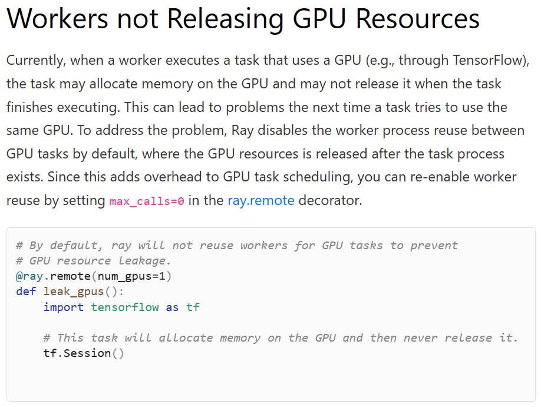

# Ray学习笔记

## 概念

| 概念                     | 含义                                                         |
| ------------------------ | ------------------------------------------------------------ |
| tasks                    | 在Ray中, 任务是很轻量级的, 一个task指的实际上是一个remote函数 |
| worker                   | 可以理解成一个python进程                                     |
| actors                   | 将task从函数扩展到了类, 当创建一个actor的时候, 同时还会创建一个新的worker, 类的方法被绑定在这个特定的worker上, worker可以访问和修改类的状态 |
| objects                  | 一个worker或者一个actor实例被创建出来之后就变成了object, 这些object可以存在在集群中的任何位置, 可以通过ref来访问 |
| placement groups         | 允许用户跨多个节点自动保留资源, 往往用于两种情况: (1)组调度, 我们需要一组任务同时开始; (2)最大化数据局部性, 减少数据移动的开销 |
| environment dependencies | 因为tasks或者actors可能在环境中的任何一个节点执行, 所以需要解决不同节点之间的环境依赖问题, 这个问题要么要用户提前在节点上都准备好需要的环境, 或者使用Ray的[runtime environments](https://docs.ray.io/en/latest/ray-core/handling-dependencies.html#runtime-environments)动态安装这些环境. |

## 资源管理

Ray允许用户指定资源, 

